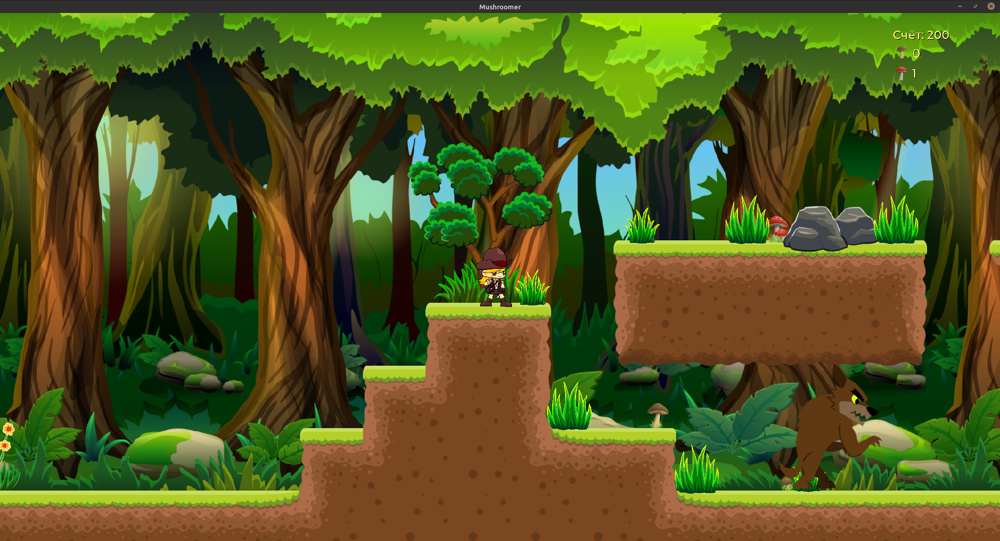

# Little mushroom picker

2D platformer created on an open engine [Godot](https://godotengine.org/). The hero will collect mushrooms in various locations: from the Deep Forest to the Desert or Cemetery. Difficult obstacles and hungry inhabitants of the forest lurk on the way.

## Control

**D** or **Right Arrow** - Forward,

**A** or **Left Arrow** - Backward,

**W** or **Up arrow** - jump,

**Space** -  cut mushroom,

**E** - Shot.

For the manufacture of euthanizing bullets, it is necessary: 1 edible mushroom and 1 inedible.
